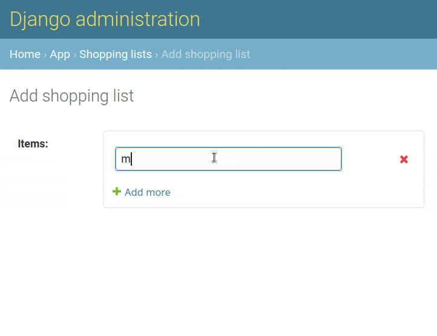

Quickstart
==========

``django-jsonform`` allows you to edit JSON data by supplying a schema for the
data structure.

Shopping list
-------------

Suppose we want to create a model for saving shopping lists. A typical shopping
list looks like this: ``['eggs', 'milk', 'juice']``.

We can efficiently store these items in a JSON array (list).

Sample model
------------

Basically, the structure of the JSON data for a shopping list is a 
**list containing strings**. So, well define a schema accordingly.

.. code-block:: python

    # models.py

    class ShoppingList(models.Model):
        items = models.JSONField() # you can also use a TextField
        date_created = models.DateTimeField(auto_now_add=True)

        ITEMS_SCHEMA = {
            'type': 'array', # a list which will contain the items
            'items': {
                'type': 'string' # items in the array are strings
            }
        }

JSON form widget
----------------

By default, Django will render the ``JSONField`` as a ``textarea``. But we can
use the ``JSONFormWidget`` for the ``items`` field to get a dyanamic, user-friendly
input.

Add this to the **admin.py** file:

.. code-block:: python

    # admin.py

    from django.contrib import admin
    from django import forms
    from django_jsonform.widgets import JSONFormWidget
    from myapp.models import ShoppingList

    class ShoppingListForm(forms.ModelForm):
        model = ShoppingList
        fields = '__all__'
        widgets = {
            'items': JSONFormWidget(schema=ShoppingList.ITEMS_SCHEMA)
        }

    class ShoppingListAdmin(admin.ModelAdmin):
        form = ShoppingListForm

    admin.site.register(ShoppingList, ShoppingListAdmin)

By the way, you can also keep the form in a **forms.py** file to keep code better
organised.

Admin site
----------

Now go the admin site and visit the *"Add new"* shopping list page. The form should
look something like this:

Next steps
----------

- The :doc:`User's guide <guide/index>` contains further details about various
  input types, uploading files and other features.
- See :doc:`schema` for a reference on the supported schema.
- See :doc:`examples` for sample schemas for declaring complex data structures.